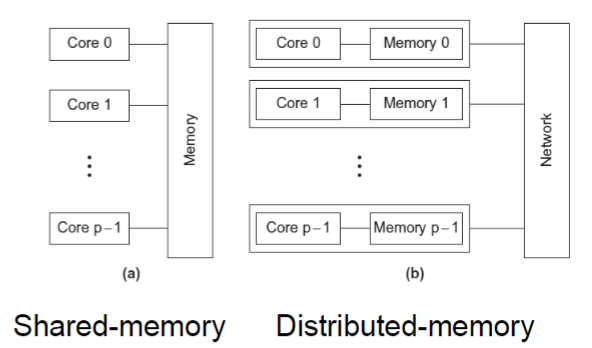

## 1. What are multi-core processors?

Chips with multiple processors installed on it. 

## 2. What is task parallelism 

A task is divided into multiple subtasks to be completed by different processors

## 3. What is data parallelism 

Data is divided equally among processors

## 4. What are the three coordination tasks

- Communication: processors may need to send data to others
- Load balancing: tasks are divided equally among processors
- Synchronise: all processors must finish the current task before being able to move on to the next 

## 5. What is the difference between concurrent, parallel and distributed 

- Concurrency is concerned with logical parallelism. Can be done in a single core processor via task switching 
- Parallel - physical parallelism. Concerned with performance increase 
- Distributed - separate computing units with separate storage connected via an interconnect. No shared memory 

## 6. What is the difference between shared memory and distributed memory systems? 

- Shared - each core can access shared memory. Coordinate by reading/writing data in shared address space. 
- Distributed - each core has separate memory. Coordinate by explicitly send and receive message. 

