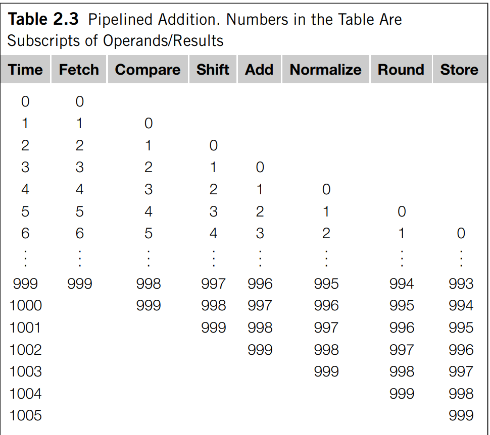
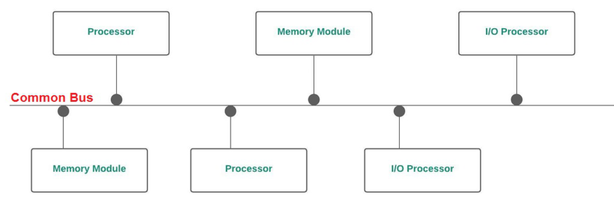
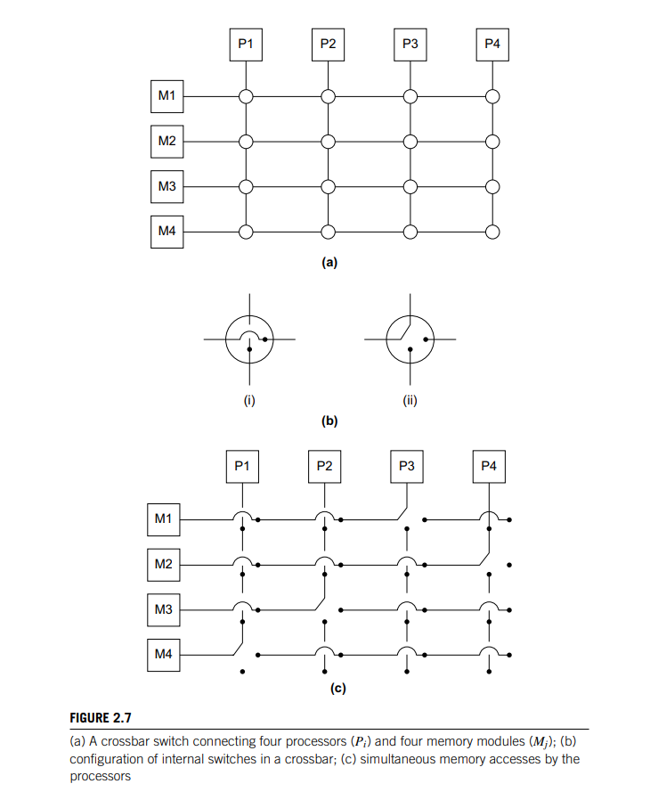
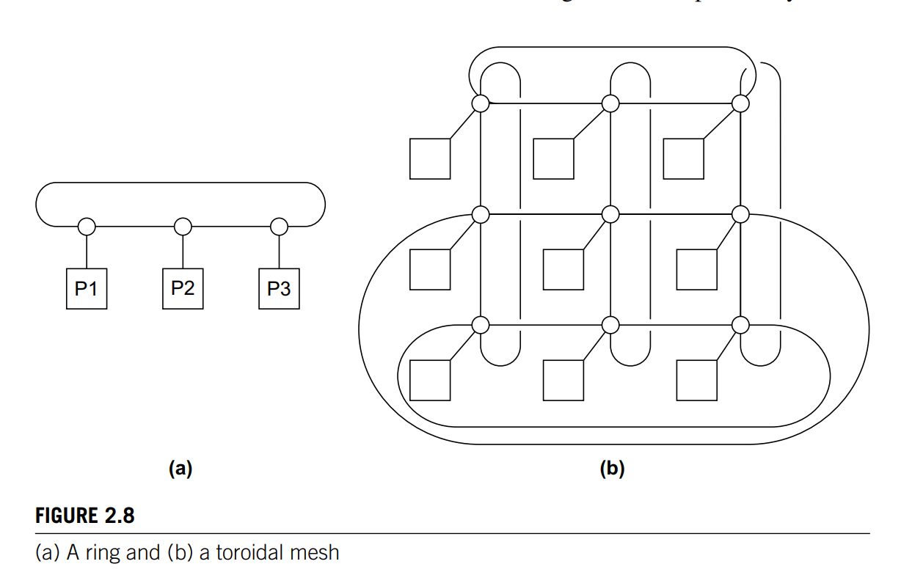

##  1. What is the von neumann architecture? 

Separate memory and processor. Instructions and data are transfered between the CPU and memory via an interconnect. 

## 2. What is the von neumann bottle neck: 

Separation between memory and processor since the interconnect determines the bandwidth. i.e. CPUs are capable of executing instructions more than 100x the speed they can read via interconnect. 

## 3. How does OS perform multitasking? 

Each process runs for a small time interval called time slice. After one program finishes one timeslice, the OS runs a different program. 

## 4. What does it mean for a program to block in a multiprocess application? 

The current thread/process needs to wait for data from another process/thread. 

## 5. What is a cache? 

Collection of memory that can be accessed more quickly than from other memory locations. A CPU cache is typically located on the same chip or one that can be accessed much faster than ordinary memory. 

## 6. Principle of Locality

Spatial - nearby location 

Temporal - accessing in the near future 

Cache data are read as cache blocks or cache lines, which store much more information than a single memory. 

## 8. What is the difference between write through and write back, what problem do they address? 

Both are used to handle inconsistency between cache value and memory value. 

Write through - update memory as soon as cache value is modified. 

Write back - when cache value is modified, it is marked as dirty. When the cache line is replaced by a new cache line, the dirty cache values are written back. 

## 9. What are different cache mapping mechanism?

- Fully associative: a cache line can be placed anywhere in the cache
- Directly mapped: each cache line has a unique location in the cache to be assigned. 
- n-way associative - can be placed in one of the n different locations

## 10. Describe virtual memory 

If running large program, we may run out of space, so a virtual memory is used as secondary storage to main memory. Only load the active components of programs on main memory. 

## 11. What are swap spaces? 

Idle parts kept in a block of secondary storage

## 12. What are pages? 

Block of data and instruction 

## 13. What are page tables? 

Page tables are used to translate the virtual addresses seen by the application into physical addresses used by hardware to process instructions. The hardware that handles the translation process is the memory management unit. 

## 14. Explain virtual paging process

When a program is compiled, its pages are assigned virtual page numbers. When it is run, a table is created that maps the virtual page number to physical addresses

## 15. Why is a thread a light-weight process? 

Threads are contained within processes, sharing access to the same memory, executables and IO devices

## 16. Describe the fork/join paradigm. 

When a process needs to execute a task, it forks a thread to carry out the execution. After the thread finishes with the task, it joins back to the original process. 

## 17. Describe Instruction Level Parallelism - pipelining:

Tasks are divided into independed subtasks carried out by hardware functional units in which the results from previous stages are used as inputs to the next stages, forming a pipeline. 

## 18. Describe Instruction Level Parallelism - multiple issue:

Replicate functional units and try to simultaneously execute different instructions in a program. 

## 19. What is a static multiple issue? 

If the functional units are scheduled at compile time, the multiple issue system is a static multiple issue. 

## 20. What is a dynamic multiple issue? 

If the functional units are scheduled at run time, the multiple issue system is a dynamic multiple issue. A processor supporting dynamic multiple issue is superscalar. 

## 21. How does the hardware make use of multiple issue? 

By doing speculation - i.e. find instructions that can be executed simultaneously. 

## 22. What is the difference between instruction level parallelism and hardware level parallelism? 

Instruction - having multiple processor components or functional units executing instructions. 

Hardware or thread level parallelism - simultaneous execution of different threads. System can still do useful work when the task being executed is stalled -i.e. run another thread. 

## 22. What is fine-grained hardware multithreading

The processor switches between threads after each instruction, skipping threads that are stalled. 

Pros: avoid stalls 

Cons:  a thread that is ready to execute a long sequence of instructions may have to wait to execute every instruction - i.e. it cannot execute no stall instructions in a sequential order. 

## 23. What is coarse-grained multithreading? 

Only switches threads that are stalled waiting for a time consuming operation to complete.

Pros: no need for instantaneous switching 

Cons: waste more clock cycles. 

## 24. What is simultaneous multithreading? 

Variation of fine-grained multi-threading. Exploit super-scalar processors by allowing multiple threads to make use of multiple functional units. 

## 25. What is SIMD?

Single instruction multiple data - i.e single control units, multiple ALUs. Data parallelism is achieved by dividing data among the ALUs to execute the same instruction. 

## 26. What is the disadvantage of SIMD? 

Processors need to work synchronously. Either work or remain idle. 

## 27. What are the pros and cons of vector processors? 

Pros: 

Fast and easy to use
Smart compiler exploiting code. 
High memory bandwidth 
Use every item in a cache line - efficient.

Cons: 

Irregular data structure 
Poor scalability 

## 28. What are the features of vector processors?

- Vectorised register - operate on array of data 
- Vectorised and pipelined functional units - same operation is applied on each element - SIMD 
- Vector instruction - instructions that operate on vectors
- Interleaved memory - memory that can be accessed independently 
- Strided memory access and handware scatter/gather - access and read write at regular and irregular intervals. 

## 29. What are GPUs? 

Graphic processing pipeline (shader functions) converts internal representation into an array of pixels that can be sent to computer screen. Shader functions are implicitly parallel - SIMD

## 30. What characterises an MIMD system? 

Fully independent cores each having its own control unit and ALU. 

## 31. What is a shared memory system? 

Autonomous processors connecting to shared memory resources via an interconnect. 

## 32. What is the difference between NUMA and UMA shared memory system. 

UMA - uniform memory access, each processor can access memory address with equal access time. 

NUMA - each processor can access some memory addresses more quickly than the other memory addresses. 

## 33. What is a distributed memory system? 

Is a cluster - collection of commidity systems connected by commodity interconnection network. Nodes are individual computational units joined by a communication network. Each node can be a separate computer. 

## 34. Bus 

Communication wires are shared by devices connected to it. Low cost and flexible. However, contention for bus use increases with number of shared devices. i.e. If we connect a large number of processors to a bus, the processors would have to wait for access to main memory. 

## 35. Switch 

Switches are used to control the routing of data among connecting devices. Crossbars allow simultaneous communication among different devices so they are much faster than buses. However the cost of switches and links is high.

## Direct interconnect 

- Ring 
- Toroidal Mesh
- Fully connected
- Hypercube 

Each switch is directly connected to a processor-memory pair. In the following figures, circles are switches, squares are processors, lines are bidirectional links. A ring can support multiple simultaneous communmications hence superior to a simple bus. Toroidal mesh is more expensive than a ring because each switch must support 5 links instead of 3, and the total number of links is 3p in a toroidal mesh compared to 2p in a ring. However, a toroidal mesh can support more simultaneous communications. 

## 16. What is the bisection width of a toroidal mesh

If $p=q^2$ is the number of switches, then the bisection width is $2\sqrt{p}=2q$

## 17. What is the bisection width of a ring 

2 

## 18. How to compute the bisection width?

The minimum number of links needed to be remove to split the set of nodes into two equal halves. 

## 19. How to compute the bisection width of a fully connected network?

Let $p$ be the number of nodes. To compute bisection width, we first divide the nodes into two equal halves, each of size $p/2$. Since each node in one partition is connected to every other node in the other partition, the number of links to be removed per node is $p/2$. Since there are $p/2$ nodes, the total number of links to remove is $p^2/4$ which is the bisection width. 

## 20. How many links are required to connect a fully connected network of degree $p$?

In  total would require $p(p+1)/2$. Each node is connected to $p-1$ nodes, and since there are $p$ nodes and each link is counted once, the number of edges is $p(p-1)/2$. Since each switch is connected to one processor, the additional links required are $p$, hence in total: $p(p-1)/2 + p = p(p+1)/2$

## 21. How to construct a hypercube 

Recursively by connecting graph edges. 

## 22. What is the bisection width of a hypercube 

p/2 

## Indirect interconnect 

The switches may not be directly connected to a processor. They have unidirectional links and a collection of processors, each has an outgoing and incoming link and a switching network. 

- Crossbar: as long as two processors dont attempt to communicate with the same processor, all processors can simultaneously communicate with another processor. 
- Omega: there are communications that cannot occur simultaneously. Omega network uses fewer switches. 

## 23. What is bisection width of a crossbar - pxp?

p

## 24. What is the bisection width of an omega network 

p/2

## 25. What is latency? 

The time that elapses between the source beginning to transmit the data and the destination starting to receive the first byte. 

## 26. What is bandwidth? 

Rate at which destination receives data after it has received the first byte. 

## 27. Time destination receives an item based on latency and bandwidth 

Latency D, bandwidth R, size L: 

$$D + L/R $$

## 28. Describe Cache Coherence 

When a variable is stored in cache of multiple processors, cache coherence ensures that an update to the value of the variable is seen by other processors i.e. the cache value should also be updated.

## 29. Describe False Sharing 

If variable is stored in shared memory, one processor must wait for cache update everytime a value in the shared memory is changed. This causes performance overhead. 

## 30. What is SPMD

The same executable with different behaviours based on different processors

## 31. Can SPMD program achieve both data parallelism and task parallelism? 

Yes. 

- Task: different processors perform different tasks 

- Data: different processors handle different partition of data 

## 32. What are embarasssingly parallel programs? 

Programs that can be parallelised simply by dividing the data among processors. 

## 33. What are the different between static threads and dynamic threads? 

Static thread: main process spawns a fixed number of threads 

Dynamic thread: main process spawns worker threads as needed

## 34. What is a race condition?

Result of variable differs based on order of execution of parallel tasks 

## 35. Describe mutual exclusion

Ensure that the critical section can only be run by one thread at a time. 

## 36. Describe critical section 

A block of code that can be executed by on thread at a time. 

## 37. Describe busy waiting 

Thread waits for the finish of execution of a critical section 

## 38. What does it mean for a function to be thread safe

Not safe to be used in multithreaded program. Usually because of race condition.

## 39. What is linear speedup.

If there are p cores and $T_{parallel}=T_{serial}/p$

## 40. Define speedup:

$$S = \frac{T_{serial}}{T_{parallel}} $$

## 41. Define efficiency:

$$E = \frac{T_{serial}}{p \times T_{parallel}} $$

## 42. Relationship between speed up and efficiency

$$E = S/p $$

## 43. Define Amdahl's law:

If fraction of unparallelisable code is r, then maximum speed up is 1/r

$$S = \frac{T_{serial}}{(1-r)T_{parallel} + rT_{serial}} \leq \frac{T_{serial}}{pT_{serial}}=\frac{1}{p}$$ 

## 44. What does it mean for a program to be scalable? 

For an increase in number of processor, if we can find an increase in problem size such that the efficiency is the same then the problem is scalable. 

## 45. What does it mean for a program to be strongly scalable? 

If we can increase the efficiency without increasing the problem size

## 46. What does it mean for a program to be weakly scalable? 

If we can keep the efficiency by setting rate of increase for problem size to be the same as for threads

## 47. What is Foster's methodology

- Partitioning - divide computation to be performed and data operated on the computation into small tasks - i.e. identifying tasks that can be executed in parallel
- Communication - determine what communication are needed among the processors
- Aggregation - combine tasks and communications into a larger task. 
- Mapping - assign the composite task to processes/threads. This should be done so that communication is minimised and each thread gets roughly the same amount of work. 

## 48. Is pipelining task parallelism? 

Yes 

## 49. Is SPMD and SIMD the same? 

No SIMD - each instruction is executed similarly by different processors. 
SPMD - different processors perform different tasks in the program determined by the conditional branching. 

## 50. What are static interconnects

Processors are directly wired to each other, no switch is involved. 

## 51. Disadvantages of static interconnects

Communication between neighbours is fast but not for distant neighbours 

## 52. Describe latency of ring, toroidal mesh, hypercube 

Ring - grows with N (number of nodes)

Toroidal mesh - grows with sqrt(N)

Hypercube - grows with log (N)

## 53. Why is max latency of hypercube log N 

Let d be dimension of hypercube, then number of nodes is $N=2^d$. Max path length is now d or log N 

## 54. How to perform routing in a hypercube, give an example of how to route from (0,1,0) to (1,0,0)

Do SRC XOR DST. The number of 1s in the result indicates how many possible paths.

0 1 0 XOR 1 0 0 = 1 1 0 hence two routes 

0 1 0 -> 1 1 0 -> 1 0 0 

0 1 0 -> 0 0 0 -> 1 0 0 

## 55. What are the advantages and disadvantages of hypercube

Pros: 

- Small diameter -> maximum latency grows with log N 
- Well defined routing strategy
- Can be subdivided into subnetworks 
- More than one shortest path between two nodes -> less contention for resources 

Disadvantages 

- Scalability -> add connection to each node 
- High wire cost - N log N. Number of connections per node = d. 

## 56. What are dynamic interconnection networks? 

Processors not connected to each other directly but through a series of switches. Switches determine the connection path. Sometimes paths can be blocked - omega network. 

