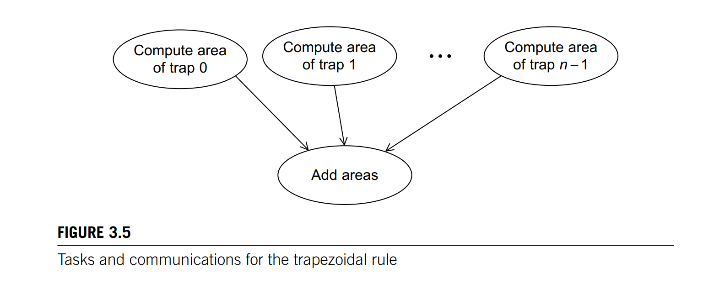
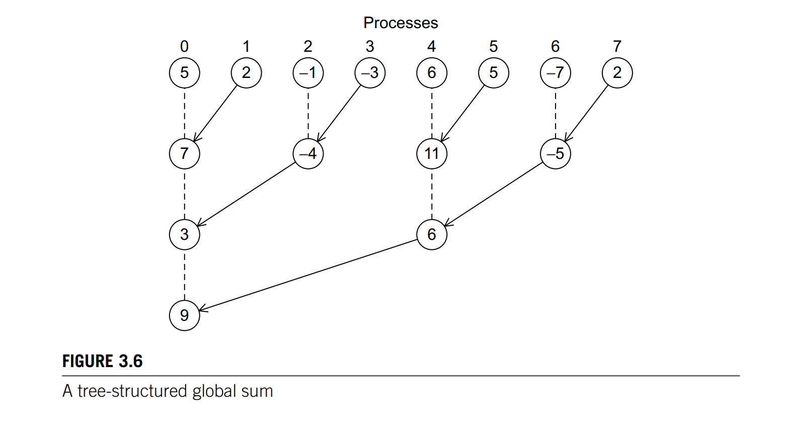
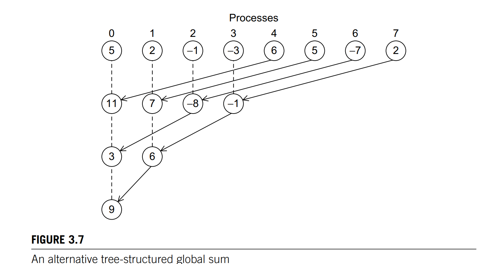
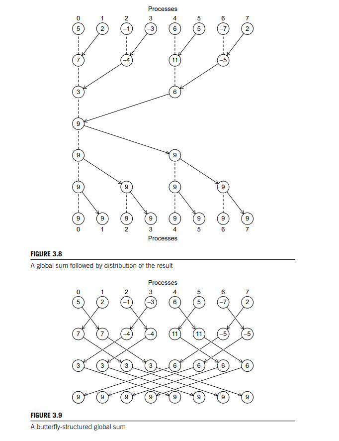
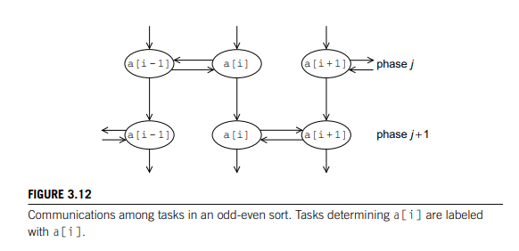

## 1. Describe two behaviours of MPI Send

When sending a message from one process to another, the processor can either 

- Copy the message to buffer and return or 
- Block until matching receive is called. 

## 2. What is collective communication? 

Communication that involves all processes in a communicator. MPI_Reduce, MPI_Allreduce

## 3. What is the difference between block partitioning, cyclic partitioning and cyclic block partitioning

- Block partitioning - index set divided into equal block sequentially
- Cyclic - index set divided in a round robin manner 
- Cyclic block - index set divided into blocks of n arranged in round robin manner 

## 4. Describe deadlock due to send and receive

For a ring pass program in which each process receives data from left neighbour and sends data to right neighbour, deadlock can occur if the send call is blocking for each processor. A way to solve this would be to have half of processors receiving first before sending. Another way is to use MPI_Sendrecv function. 

## 5. If a program does not come close to obtaining a linear speedup for small n and large p, is it a bad program? 

Use scalability concept to answer this. If the program is scalable, then it can still be used.

## 6. Difference between MPI_Reduce and MPI_Allreduce 

MPI_Allreduce is equivalent to computing the result of reduction then performing a broadcast. The implementation can be a tree like structre or a butterfly, which is hidden from users. Same logic applies to MPI_Allgather

## 7. Different MPI functions 

- `MPI_Init`: do the necessary setup. Define a communicator consisting of all processes started by the user wheh the program is started. 
- `MPI_Finalize`: free up all MPI resources 
- `MPI_Send`: send data to another processor. Either blocking or non blocking. (non blocking is unsafe)
- `MPI_Receive`: receive data from another processor. Always block.
- `MPI_Reduce`: collective communication involving data from all processors
- `MPI_Allreduce`: equivalent of computing result then broadcast the result.
- `MPI_Broadcast`: broadcast values from one processor to all processors 
- `MPI_Scatter`: generate partitions of an array and distribute the partitions to the corresponding processors. 
- `MPI_Gather`: gather data from all processors to form an array 
- `MPI_Allgather`: gather then broadcast 
- `MPI_Ssend`: synchronous send - always blocking 
- `MPI_Sendrecv`: send and receive to avoid deadlock 

## 8. Draw tasks and communication for trapezoidal rule: 

## 9. Drawn different global sum tree structures. Which one does MPI_Reduce use? 

Not known by the user - system dependent

## 10. Draw two different reduce + broadcast tree structures. Which one does MPI_Allreduce or MPI_Allgather use? 

Can be one of these, implementation is system dependent. 

## 11. Draw task communication in odd even sort: 

