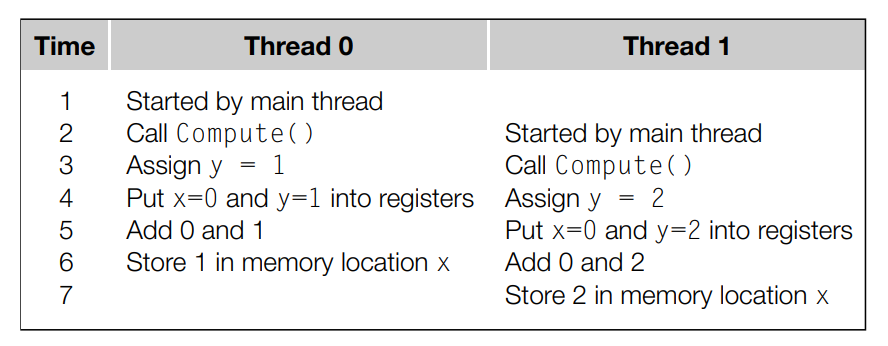

## 1. What is busy waiting and how is it implemented 

Each thread must wait for other threads to finish the task in the critical section before being able to enter the critical section. Implemented using a global flag. Initially set the flag to 0 then check rank and flag using an empty while loop. When finish execution, increase flag value by 1. 

```
// flag initially set to 0
while (flag != my_rank); // Initially only procesor 0 can enter cs
// Critical section
flag = flag + 1 //Increment flag so processore 1 can enter cs 
```

## 2. Why is the disadvantage of busy waiting 

A thread that is busy waiting is still using CPU resources. 

## 3. How does mutex guarantee mutual access to the critical section? 

It needs to initialise a special mutex variable with `pthread_mutex_init`
When a thread needs to gain access to critical section, it needs to acquire mutex lock using `pthread_mutex_lock`. When it finishes executing the code, it calls `pthread_mutex_unlock`. Lock ensures that no other thread can enter the critical section -i.e. the other threads will block until unlock. Unlock notifies the system that the current thread execution of the critical section is complete; the system then decides on the next thread to give mutex lock to. Mutex is declared as a global variable. 

```
// mutex variable declared 
pthread_mutex_lock(&mutex) // Only one process acquires lock and enter cs.
//Critical section
pthread_mutex_unlock(&mutex) // Process relinquishes mutex and os schedule the next process
```

## 4. Difference between mutex and busy waiting w.r.t order of execution? 

Busy waiting is executed in rank order - i.e. rank 0 folllowed by 1, 2, 3. 

Mutex order of execution is random. 

## 5. Why is the performance of busy waiting worse when number of threads is much more than the number of cores? 

Suppose there are two cores and five threads. Initially there are threads 0 and 1. 0 finishes critical section and is decommissioned. When 1 is in critical section, OS can schedule 2, 3, 4 to enter. When 1 is complete, it sets the flag to 2. Suppose the OS schedule a thread other than 2, then this thread must busy wait until being descheduled by the OS, which then choose one of the thread in threadpool to schedule, which may not be two and repeat the time wasting busy wait process. This terminates when 2 is scheduled, but may have already wasted a lot of time.  

## 6. Racecondition timeline table for shared variable x modified by x = x + y for two threads, where y value for thread 0 is 1 and y value for thread 1 is 2: 

