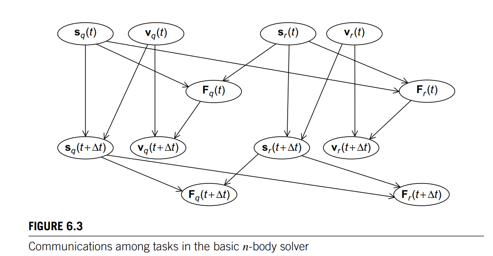
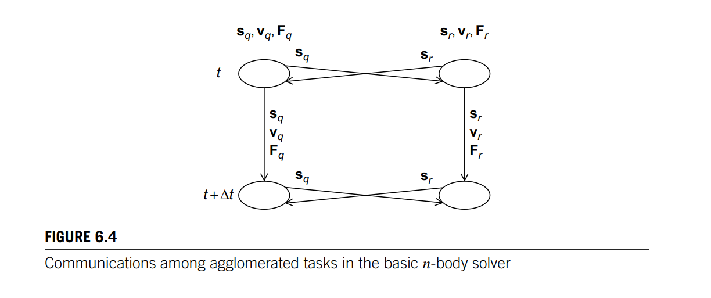

## 1. Draw communication and aggregated tasks in n body solver

## 2. Draw communication diagram for Histogram bin count 

- Divide the data among the threads 
- For each data partition, find bin counts for all the bins
- Sum all the local bin counts 

## 3. What is a host in OpenCL 

CPU or main process 

## 4. What is a device in OpenCL 

Devices are other CPUs or GPUs

## 5. What is a work-item in OpenCL

Smallest unit of execution - a thread in CUDA 

## 6. What is a work group in OpenCL 

Work-items are grouped to form work-group.

## 7. What is a kernel in OpenCL 

The code for a work item 

## 8. What is a program in OpenCL 

Collection of kernels and other functions (dynamic library)

## 9. What is a context in OpenCL 

Environment within which work-items execute, including devices and their memories and command queues

## 10. What is a command queue?

Queue used by the host application to submit work to a device. Work can be executed in order or out of order. 

## 11. Describe the memory hierrachy of OpenCL 

Host Memory 

Global Memory - can be accessed by all work-group

Local Memory - memory local to each work-group. Every work group can access local memory of other group. Workers within the same work group have access to local memory.

Private Memory - private memory of each thread (work-item)

## 12. Describe OpenCL process 

- Initialise compute device 
- Define problem domain 
- Allocate memory on host and device
- Copy data from host to device 
- Launch kernel on device 
- Copy data from device to host 
- Repeat 
- Deallocate resources 