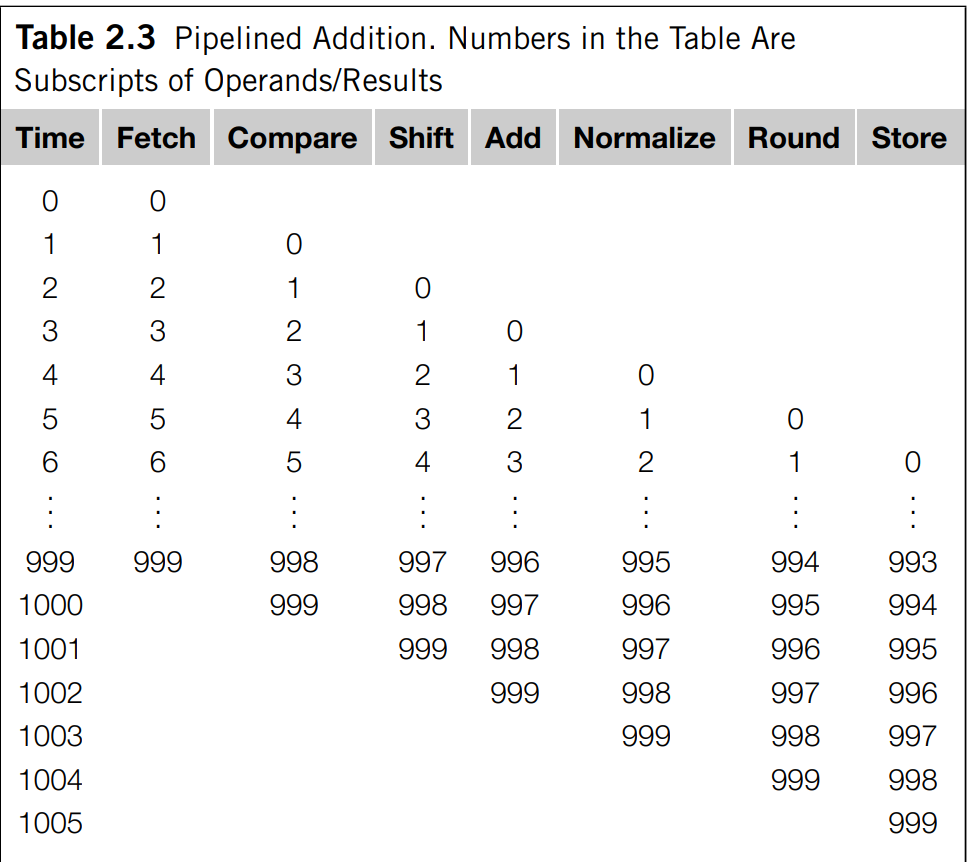
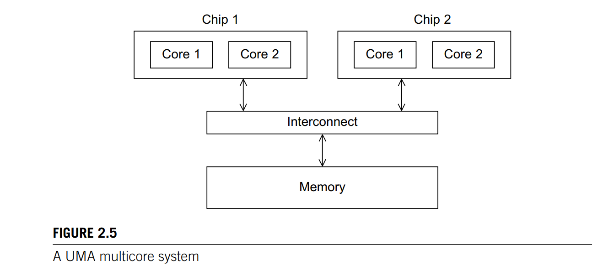
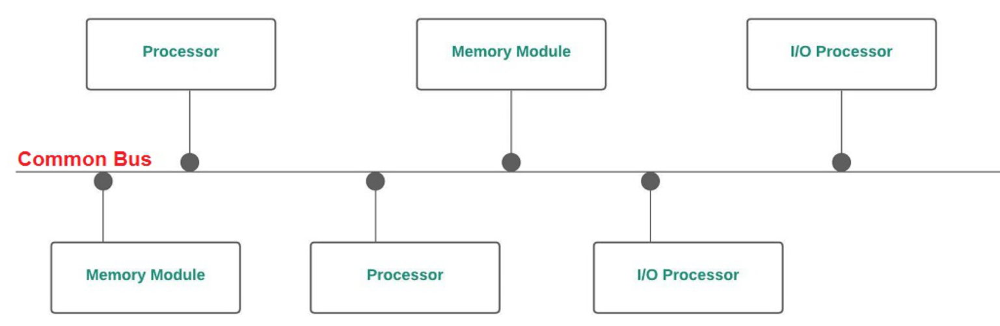
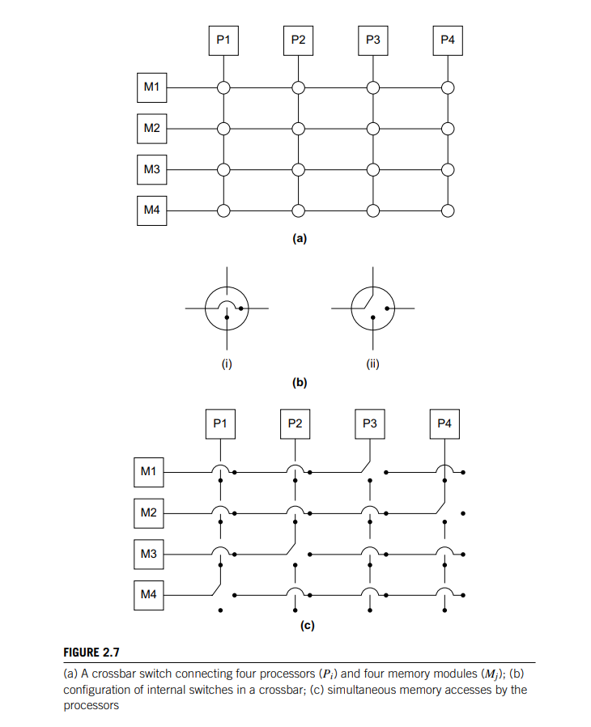
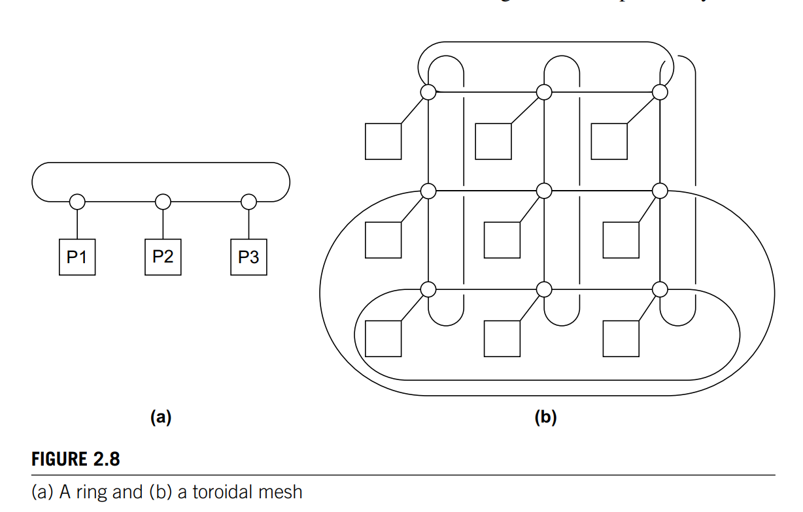

## 1. What is the difference between task parallelism and data parallelism? 

- Task parallelism: partition the tasks amomng the cores 
- Data parallelism: partition the data used in solving the problem among the core. 

## 2. Different coordination tasks

- Communication: cores need to communicate to share their private variables
- Load balancing: cores are to be assigned roughly the same number of values to compute. 
- Synchronisation: cores need to wait before moving to the next section of the code

## 3. Difference between shared memory system and distributed memory system

- Shared memory: the cores can share access to the computer's memory. Each core can read and write each memory location. Coordination is achieved by 
having cores examining and updating shared memory locations. 
- Distributed: each core has their own private memory. Cores must communicate explicitly by sending messages across a network. 

## 4. Difference between concurrent, parallel and distributed computing 

- Concurrency - logical parallel execution. Can be achieved by mulitasking - switching the execution between different threads/processes. 
- Parallel - physical parallel execution. Concerned with performance improvement
- Distributed - concerned with convenience - scalability, availability, durability, etc 

## 5. What does it mean for a program to block in a multiprocess application? 

The current thread/process needs to wait for data from another process/thread. 

## 6. Why is thread a light-weight processes? 

Threads are contained within processes, sharing access to the same memory, executables and IO devices

## 7. Describe the fork/join paradigm. 

When a process needs to execute a task, it forks a thread to carry out the execution. After the thread finishes with the task, it joins back to the original process. 

## 8. Describe Instruction Level Parallelism - pipelining:

Tasks are divided into independed subtasks carried out by hardware functional units in which the results from previous stages are used as inputs to the next stages, forming a pipeline. 

## 9. Describe Instruction Level Parallelism - multiple issue:

Replicate functional units and try to simultaneously execute different instructions in a program. If the functional units are scheduled at compile time, the multiple issue system is a static multiple issue. If the functional units are scheduled at run time, the multiple issue system is a dynamic multiple issue. A processor supporting dynamic multiple issue is superscalar. 

## 10. Describe SIMD

SIMD - apply the same instruction to multiple data - single control unit, multiple ALUs. An instruction is broadcast to all ALUs. Ideal for data parallelism. 

## 11. Describe MIMD systems

Fully independent processing units each has its own control unit and ALU. MIMD are asynchronous. Each processor can operator at their own pace. No global clock and there can be no relation between times on different processors. There are two principal types of MIMD - shared memory system and distributed memory system. 

## 12. Descibe the architecture of Shared memory system 

Use one or more multicore processors. Has multiple CPUs on a single chip. Each core has a private L1 cache, while other cache may or may not be shared between the cores. 

The interconnect can

- Connect all processors directly to the main memory: time to access memory is the same for all cores (UMA)
- Each processor can have a direct connection to a block of main memory: accessing time is faster for memory directly connected to a core (NUMA).

## 13. Distributed memory system architecture:

Clusters - collection of commodity systems - i.e. PC connected by interconnection network - i.e. ethernet 

## 14. Shared memory interconnect

### Bus 

Communication wires are shared by devices connected to it. Low cost and flexible. However, contention for bus use increases with number of shared devices. i.e. If we connect a large number of processors to a bus, the processors would have to wait for access to main memory. 

### Switch 

Switches are used to control the routing of data among connecting devices. Crossbars allow simultaneous communication among different devices so they are much faster than buses. However the cost of switches and links is high.

## 15. Distributed memory interconnect 

### Direct interconnect 

- Ring 
- Toroidal Mesh
- Fully connected
- Hypercube 

Each switch is directly connected to a processor-memory pair. In the following figures, circles are switches, squares are processors, lines are bidirectional links. A ring can support multiple simultaneous communmications hence superior to a simple bus. Toroidal mesh is more expensive than a ring because each switch must support 5 links instead of 3, and the total number of links is 3p in a toroidal mesh compared to 2p in a ring. However, a toroidal mesh can support more simultaneous communications. 

## 16. What is the bisection width of a toroidal mesh

If $p=q^2$ is the number of switches, then the bisection width is $2\sqrt{p}=2q$

## 17. What is the bisection width of a ring 

2 

## 18. How to compute the bisection width?

The minimum number of links needed to be remove to split the set of nodes into two equal halves. 

## 19. How to compute the bisection width of a fully connected network?

Let $p$ be the number of nodes. To compute bisection width, we first divide the nodes into two equal halves, each of size $p/2$. Since each node in one partition is connected to every other node in the other partition, the number of links to be removed per node is $p/2$. Since there are $p/2$ nodes, the total number of links to remove is $p^2/4$ which is the bisection width. 

## 20. How many links are required to connect a fully connected network of degree $p$?

In  total would require $p(p+1)/2$. Each node is connected to $p-1$ nodes, and since there are $p$ nodes and each link is counted once, the number of edges is $p(p-1)/2$. Since each switch is connected to one processor, the additional links required are $p$, hence in total: $p(p-1)/2 + p = p(p+1)/2$

## 21. How to construct a hypercube 

Recursively by connecting graph edges. 

## 22. What is the bisection width of a hypercube 

p/2 

## Indirect interconnect 

The switches may not be directly connected to a processor. They have unidirectional links and a collection of processors, each has an outgoing and incoming link and a switching network. 

- Crossbar: as long as two processors dont attempt to communicate with the same processor, all processors can simultaneously communicate with another processor. 
- Omega: there are communications that cannot occur simultaneously. Omega network uses fewer switches. 

## 23. What is bisection width of a crossbar - pxp?

p

## 24. What is the bisection width of an omega network 

p/2

## 25. What is latency? 

The time that elapses between the source beginning to transmit the data and the destination starting to receive the first byte. 

## 26. What is bandwidth? 

Rate at which destination receives data after it has received the first byte. 

## 27. Time destination receives an item based on latency and bandwidth 

Latency D, bandwidth R, size L: 

$$D + L/R $$

## 28. Describe Cache Coherence 

When a variable is stored in cache of multiple processors, cache coherence ensures that an update to the value of the variable is seen by other processors i.e. the cache value should also be updated.

## 29. Describe False Sharing 

If variable is stored in shared memory, one processor must wait for cache update everytime a value in the shared memory is changed. This causes performance overhead. 

## 30. What is SPMD

The same executable with different behaviours based on different processors

## 31. Can SPMD program achieve both data parallelism and task parallelism? 

Yes. 

- Task: different processors perform different tasks 

- Data: different processors handle different partition of data 

## 32. What are embarasssingly parallel programs? 

Programs that can be parallelised simply by dividing the data among processors. 

## 33. What are the different between static threads and dynamic threads? 

Static thread: main process spawns a fixed number of threads 

Dynamic thread: main process spawns worker threads as needed

## 34. What is a race condition?

Result of variable differs based on order of execution of parallel tasks 

## 35. Describe mutual exclusion

Ensure that the critical section can only be run by one thread at a time. 

## 36. Describe critical section 

A block of code that can be executed by on thread at a time. 

## 37. Describe busy waiting 

Thread waits for the finish of execution of a critical section 

## 38. What does it mean for a function to be thread safe

Not safe to be used in multithreaded program. Usually because of race condition.

## 39. What is linear speedup.

If there are p cores and $T_{parallel}=T_{serial}/p$

## 40. Define speedup:

$$S = \frac{T_{serial}}{T_{parallel}} $$

## 41. Define efficiency:

$$E = \frac{T_{serial}}{p \times T_{parallel}} $$

## 42. Relationship between speed up and efficiency

$$E = S/p $$

## 43. Define Amdahl's law:

If fraction of unparallelisable code is r, then maximum speed up is 1/r

$$S = \frac{T_{serial}}{(1-r)T_{parallel} + rT_{serial}} \leq \frac{T_{serial}}{pT_{serial}}=\frac{1}{p}$$ 

## 44. What does it mean for a program to be scalable? 

For an increase in number of processor, if we can find an increase in problem size such that the efficiency is the same then the problem is scalable. 

## 45. What does it mean for a program to be strongly scalable? 

If we can increase the efficiency without increasing the problem size

## 46. What does it mean for a program to be weakly scalable? 

If we can keep the efficiency by setting rate of increase for problem size to be the same as for threads